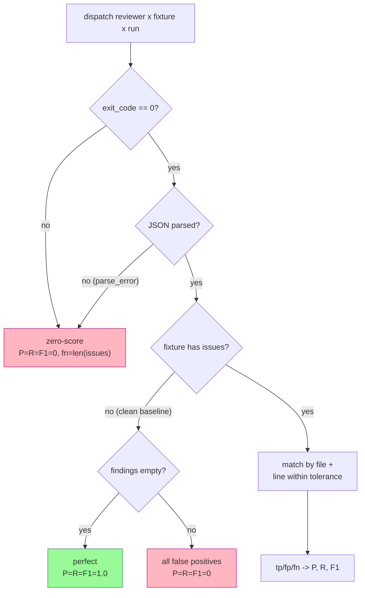
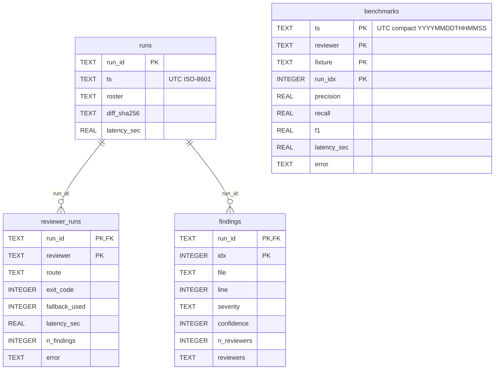

# Argus — Development Guide

Multi-model code review skill. Dispatches diffs to a roster of LLM reviewers in parallel, filters by confidence with cross-reviewer corroboration, and produces one merged review.

## Prerequisites

- **Python** 3.12+
- **aichat** 0.30+ ([github.com/sigoden/aichat](https://github.com/sigoden/aichat))
- **pip** packages: `pyyaml`, `psutil`
- At least one CLI reviewer: `claude`, `codex`, `gemini`, `opencode`, or `copilot`
- At least one API key: `OPENROUTER_API_KEY` (covers 9 of 15 reviewers)

## Setup

```bash
git clone https://github.com/jimstratus/argus.git
cd argus
export ARGUS_HOME="$PWD"
pip install pyyaml psutil

# Configure aichat (api_base only; keys stay in env)
python scripts/install_aichat.py --merge

# Verify reachability
python scripts/verify.py --all
```

## Environment

API keys live in env — **never** written to disk by Argus. aichat reads `AICHAT_<CLIENT>_API_KEY`, which Argus forwards at subprocess dispatch time.

```bash
export OPENROUTER_API_KEY=***       # public default route — covers most reviewers
export ZAI_API_KEY=***              # GLM-5.2 direct
export MINIMAX_API_KEY=***          # MiniMax M3 direct
export DEEPSEEK_API_KEY=***         # DeepSeek V4 Pro direct (api.deepseek.com)
export KIMI_API_KEY=***
export GEMINI_API_KEY=***
export OPENAI_API_KEY=***
export NOUSRESEARCH_API_KEY=***     # optional

# Optional: route preference for dual-route reviewers (default: openrouter)
export ARGUS_ROUTE_PREF=direct
```

## Project Structure

```
argus/
├── SKILL.md                    # Claude Code skill entry
├── README.md                   # Human-facing overview
├── CLAUDE.md                   # Project context for contributors
├── CONTRIBUTING.md             # Contribution guidelines
├── config.yaml                 # Reviewers, profiles, host rules, CLI commands, aichat patches
├── prompts/
│   ├── reviewer_prompt.md      # Strict-schema JSON prompt (base)
│   └── overlays/
│       ├── security.md
│       ├── deep.md
│       └── audit.md
├── scripts/
│   ├── _common.py              # Shared helpers (subprocess, JSON, config, history.db)
│   ├── detect_host.py          # Host CLI detection
│   ├── dispatch.py             # Parallel reviewer fan-out
│   ├── merge.py                # Confidence filter + corroboration + output
│   ├── benchmark.py            # Fixture-suite leaderboard
│   ├── aggregate_bench.py      # Merge per-reviewer JSONs from parallel-shell runs
│   ├── estimate_cost.py        # Pre-flight cost gate
│   ├── bench_cost.py           # Retrospective cost analysis
│   ├── verify.py               # Route reachability ping
│   ├── or_balance.py           # OpenRouter balance check
│   ├── stats.py                # history.db summary
│   ├── install_aichat.py       # aichat config management
│   └── adapters/
│       ├── aichat.py
│       ├── gemini_cli.py
│       ├── codex_cli.py
│       ├── claude_cli.py
│       ├── opencode_cli.py
│       └── copilot_cli.py
├── fixtures/                   # Benchmark inputs (diff.patch + ground-truth.json)
├── tests/                      # Unit tests (pytest; run in CI)
├── .github/workflows/ci.yml    # GitHub Actions — pytest on push/PR
├── runs/                       # Per-invocation artifacts (gitignored)
├── benchmarks/                 # Leaderboard outputs (gitignored)
└── history.db                  # SQLite — runs, findings, benchmarks (gitignored)
```

## Key Scripts

### Review Pipeline

```bash
# Estimate cost before running
python scripts/estimate_cost.py --roster "glm-5.2,minimax-m3,gemini-or,codex" \
  --diff <(git diff HEAD)

# Dispatch parallel review
RUN_DIR="$ARGUS_HOME/runs/$(date +%Y%m%dT%H%M%S)-manual"
mkdir -p "$RUN_DIR"
git diff HEAD > "$RUN_DIR/diff.patch"
python scripts/dispatch.py --run-dir "$RUN_DIR" \
  --roster "glm-5.2,minimax-m3,gemini-or,codex" \
  --diff "$RUN_DIR/diff.patch"

# Merge results
python scripts/merge.py --run-dir "$RUN_DIR"
```

### Benchmark

```bash
# Full benchmark suite
python scripts/benchmark.py --runs 3 --profile standard --progress

# For large rosters, use parallel shells:
TS=$(date +%Y%m%dT%H%M%S)
for reviewer in glm-5.2 minimax-m3 gemini-or codex opencode; do
  python scripts/benchmark.py \
    --roster "$reviewer" \
    --runs 3 --progress \
    --benchmark-ts "$TS" \
    --max-wall-sec 600 &
done
wait
python scripts/aggregate_bench.py --ts "$TS"
```

### Verification

```bash
# Check all reviewer routes
python scripts/verify.py --all

# Check specific reviewer
python scripts/verify.py --roster glm-5.2

# JSON output for scripting
python scripts/verify.py --json --all
```

### Stats

```bash
python scripts/stats.py
```

## Architecture Notes

### Roster Policy — single source of truth

All roster policy lives in `_common.resolve_roster` — dispatch.py and
benchmark.py both call it; **never add inline roster filters elsewhere**.
Semantics:

| | explicit `--roster` names | profile-based roster |
|---|---|---|
| `disabled: true` | kept (explicit naming = intent) | dropped |
| `custom_only: true` | kept | dropped |
| `tier: free` | needs `--allow-free` | needs `--allow-free` |
| `privacy: LOGS` | needs `--allow-logging` | needs `--allow-logging` |
| host_rules `skip` | applied | applied |
| host_rules `add` | **not** applied | applied |
| not in registry | dropped | dropped |

Drops are written to `dispatch_summary.json` under `"dropped"` and noted on
stderr. `estimate_cost.py` rejects unknown reviewer names outright (exit 2,
labeled `INVALID ROSTER` so it can't be mistaken for a cost block).

### Route Preference — single source of truth

Reviewers `glm-5.2`, `minimax-m3`, and `deepseek-v4-pro` are **dual-route**:
each declares a direct-provider API route and an OpenRouter route (as
`primary`/`fallback` in `config.yaml`). `_common.resolve_routes(spec, preference)`
returns the `(primary, fallback)` pair **ordered by preference** at dispatch
time — dispatch.py, verify.py, benchmark.py, and estimate_cost.py all call it
(**never re-order routes inline**).

| `route_preference` | Tries first | Fallback |
|---|---|---|
| `openrouter` *(default)* | OpenRouter route | direct-API route |
| `direct` | direct-API route | OpenRouter route |

Classification (`_common._route_kind`): an `aichat` route with
`client: openrouter` is `openrouter`; any other `aichat` route is `direct`; a
non-aichat route is `cli`. **Only the exact `{direct, openrouter}` pair is
reordered** — CLI reviewers (which may keep OpenRouter as a *true* fallback,
e.g. `codex`) are never reordered, so a free CLI sub is never demoted below a
paid OpenRouter fallback.

Preference precedence (`_common.resolve_route_preference`):
**CLI flag (`--route-pref` / `--prefer-direct` / `--prefer-openrouter`) ›
`ARGUS_ROUTE_PREF` env › `defaults.route_preference` › `openrouter`**.
The OR-balance pre-flight in estimate_cost/benchmark only fires when OpenRouter
is the *resolved primary* for some reviewer, so a `direct`-preference run with a
depleted OR balance is not gated.

### Host-CLI Awareness

`detect_host.py` inspects env markers + the parent process tree. Returns
`claude | codex | gemini | opencode | unknown`. Env markers are specific
variables (e.g. `CLAUDECODE=1`, `CODEX_SANDBOX`) — credential-shaped vars
like `CODEX_API_KEY` don't trigger detection. The process walk (psutil, up
to 8 levels) matches argv[0]/argv[1] basenames only, never full command
lines, so a wrapping shell containing `--roster codex` can't misdetect.

### Confidence Filter + Corroboration

- Findings with effective confidence < 80 are dropped (`defaults.confidence_threshold`)
- +15 confidence bonus, cap 100, when >=2 reviewers agree (`defaults.corroboration_boost`)
- Merge clusters findings per file by anchor-based line proximity within
  `defaults.merge_line_tolerance` (default ±3, `--line-tolerance` to override);
  the cluster reports its median line, worst severity, and concatenated
  descriptions. See README "Merge logic" for the dual-tolerance walk.

### Cost Gates

| Mode | Warn | Hard block | Override |
|------|------|-----------|----------|
| review | $0.50 | $2.00 | `--yes-cost` |
| benchmark | $10 | $30 | `--yes-cost` / `ARGUS_YES_COST=1` |
| OR balance | warn in review mode | blocks in benchmark mode | `--skip-balance-check` |

`estimate_cost.py` exit codes: `0` OK, `1` warn, `2` block or invalid roster
(check stderr). Paid-CLI reviewers (`cost_per_m: null`) count as $0.

### Subprocess Layer

`_common.run_subprocess` resolves argv[0] via a cached `shutil.which`, pipes
the prompt on **stdin** (never argv — Windows ARG_MAX), and on timeout kills
the entire process tree: children run in their own session, `os.killpg` on
POSIX, `taskkill /T /F` on Windows. Adapters return a uniform dict:
`{route, cmd, exit_code, stdout, stderr, latency_sec}`.

`load_config()` is `lru_cache`d and returns a **shared dict — treat it as
read-only**. The prompt template read is cached too.

### JSON Extraction

`_common.extract_json` tries, in order: raw parse → strip `<think>` blocks
(Qwen3/DeepSeek-R1) → fenced code blocks → balanced object containing
`"findings"`/`"ok"` → a single O(n) string-aware pass over all balanced
`{...}` spans (max 50 parse attempts). The scanner tracks string/escape
state, so braces inside description values don't truncate the object.
`normalize_findings` clamps off-enum severities to `medium`.

### Benchmark Scoring



The clean-baseline `1.0` applies **only to successful, parseable runs** —
a reviewer whose call failed or returned prose is zero-scored everywhere,
so broken reviewers can't rank above working ones. `aggregate_bench.py`
applies the same rule when re-scoring per-reviewer JSONs from
parallel-shell runs. Benchmark timestamps are UTC.

### history.db Schema



`benchmarks` is keyed independently (no FK to `runs`) — review runs and
benchmark runs are separate timelines. `stats.py --since` normalizes both
timestamp formats to a common `YYYYMMDDTHHMMSS` prefix before comparing.

## Testing

```bash
# Unit tests (no network, no API keys; also run by CI on every push/PR)
python -m pytest tests/ -q

# Verify all routes are reachable
python scripts/verify.py --all

# Dry-run benchmark (one fixture, one run)
python scripts/benchmark.py --runs 1 --fixtures sql-injection --progress

# Cost estimate without dispatching
python scripts/estimate_cost.py --roster "glm-5.2,minimax-m3,gemini-or,codex" \
  --diff <(git diff HEAD)
```

Unit coverage: `extract_json` edge cases (think-blocks, fences,
braces-in-strings, O(n) garbage handling), merge clustering/corroboration,
benchmark scoring, and `run_subprocess` timeout + process-tree kill.
Always dry-run a benchmark (`--runs 1 --fixtures <one>`) with a new roster
before a full run — it catches provider-config bugs in ~30s instead of 40min.

## Code Style

- Python 3.12+. Type hints where they clarify; not exhaustive.
- No new dependencies without justification (`pyyaml` + `psutil` is the current bar)
- New CLI adapters follow the pattern in `scripts/adapters/`

## Known Gotchas

- **Windows .cmd shim tree-kill**: fixed — `run_subprocess` kills the whole process tree on timeout (killpg on POSIX, `taskkill /T /F` on Windows). gemini-direct stays disabled until re-tested on Windows; `gemini-or` remains the default route.
- **OpenRouter reasoning providers**: `z-ai/glm-5.2` and `minimax/minimax-m3` may route to providers returning `{content: null}`. Mitigation: aichat patch applies reasoning-exclude + provider-ignore.
- **Argv length on Windows (~32KB)**: fixed — all CLI adapters pipe the prompt via stdin; no adapter embeds it in argv.
- **Full-codebase audit prompt mismatch**: Default prompt optimized for PR review. Use `--overlay audit` for empty-tree→HEAD diffs.
