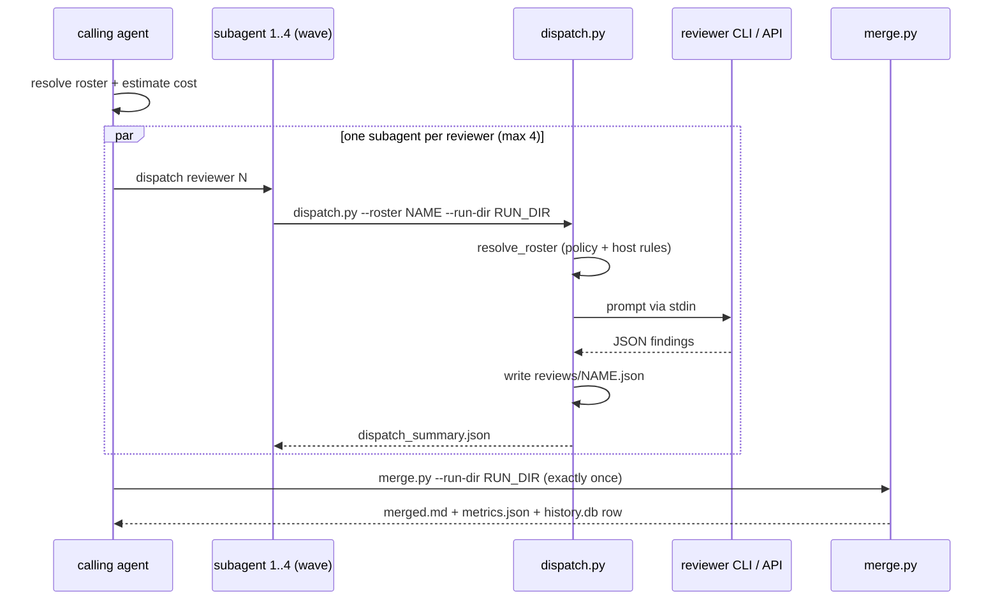
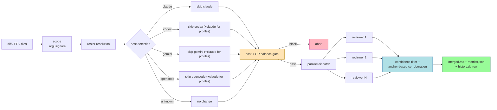
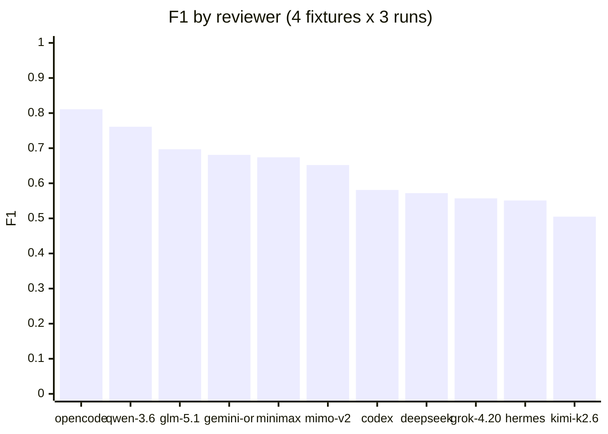
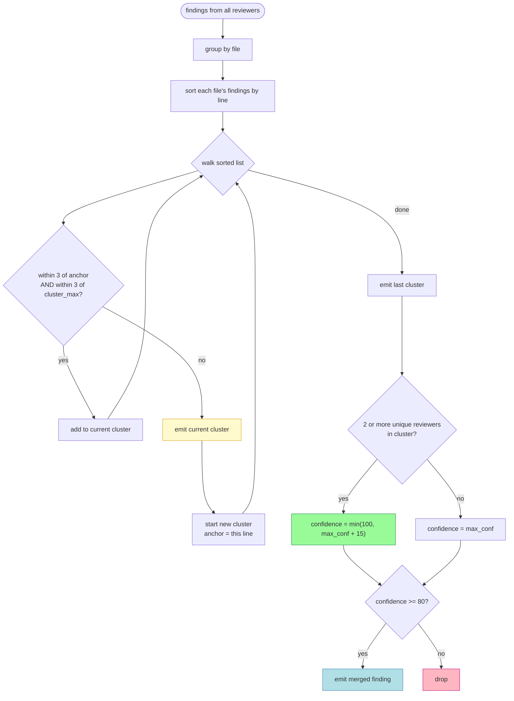
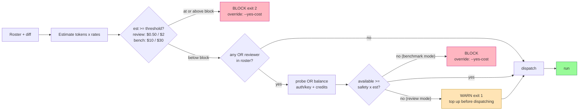

<div align="center">

```
     █████╗ ██████╗  ██████╗ ██╗   ██╗███████╗
    ██╔══██╗██╔══██╗██╔════╝ ██║   ██║██╔════╝
    ███████║██████╔╝██║  ███╗██║   ██║███████╗
    ██╔══██║██╔══██╗██║   ██║██║   ██║╚════██║
    ██║  ██║██║  ██║╚██████╔╝╚██████╔╝███████║
    ╚═╝  ╚═╝╚═╝  ╚═╝ ╚═════╝  ╚═════╝ ╚══════╝

        ●  ●  ●  ●  ●  ●  ●  ●  ●  ●  ●  ●
       ●  ●  ●  ●  ●  ●  ●  ●  ●  ●  ●  ●  ●
        multi-model code review, in parallel
       ●  ●  ●  ●  ●  ●  ●  ●  ●  ●  ●  ●  ●
        ●  ●  ●  ●  ●  ●  ●  ●  ●  ●  ●  ●
```

**Named for Argus Panoptes — the hundred-eyed giant. The original Linus's Law.**

[](LICENSE)
[](https://www.python.org)
[](https://github.com/sigoden/aichat)
[](#roster)
[](https://github.com/jimstratus/argus/actions)
[](https://github.com/jimstratus/argus/commits)
[](https://github.com/jimstratus/argus/stargazers)

</div>

---

## What

Argus dispatches a diff, PR, or file set to a roster of frontier LLM reviewers — Chinese, Western, and CLI-hosted models — in parallel, applies a confidence filter with cross-reviewer corroboration, and produces one merged review.

It also benchmarks reviewers against labeled fixtures so you can see which models actually find bugs in your domain vs. which ones hallucinate them.

## Dispatch pattern

Argus has two dispatch modes; the calling agent picks one per run:

- **Default — subagent-per-reviewer.** The calling agent fans out one
  subagent per reviewer (Claude Code: Agent tool with
  `run_in_background: true`), each running `dispatch.py` against a single
  reviewer. Concurrency cap: **4 parallel subagents**. If the roster has
  more than 4 reviewers, queue the rest and dispatch as each completes.
  Gives per-reviewer streaming visibility and isolated failure modes.
- **Legacy / quick path — single-process dispatch.** For rosters of ≤4
  reviewers (or when per-reviewer subagent visibility isn't needed), call
  `dispatch.py --roster a,b,c,d` once. Argus's internal
  `defaults.max_parallel: 4` (config.yaml) still applies.



Every roster entry produces a `reviews/<name>.json` — timeouts, crashes, and
parse failures included — so `merge.py` always sees the full picture.

See [`SKILL.md` step 6](SKILL.md) for the canonical execution recipe.

## Why

- **A single LLM reviewer misses bugs.** (They all do, including Opus and GPT-5.)
- **Two LLM reviewers produce noise.** Disagreement without arbitration.
- **Six LLM reviewers filtered by cross-corroboration and confidence** produce meaningfully better reviews than any one model alone.

Argus picks the right six for you, then filters ruthlessly.

---

## Pipeline



---

## Roster

Reviewers marked **dual-route** have both a direct-provider API route and an
OpenRouter route; which one is tried first is governed by
[route preference](#routing--openrouter-vs-direct-api).

| Reviewer | Route(s) | Notes |
|---|---|---|
| `glm-5.2` | **dual-route**: z.ai Coding Plan ↔ OR `z-ai/glm-5.2` | strong security + logic |
| `minimax-m3` | **dual-route**: minimaxi.chat ↔ OR `minimax/minimax-m3` | high precision |
| `deepseek-v4-pro` | **dual-route**: api.deepseek.com ↔ OR `deepseek/deepseek-v4-pro` | 1.6T MoE, 1M ctx, reasoning + security |
| `kimi-k2.6` | aichat → OR `moonshotai/kimi-k2.5` | long-context agentic |
| `mimo-v2-pro` | aichat → OR `xiaomi/mimo-v2-pro` | 1M ctx |
| `qwen-3.6-plus` | aichat → OR `qwen/qwen3.6-plus` | 1M ctx, conservative |
| `grok-4.20` | aichat → OR `x-ai/grok-4.20` | 2M ctx, pricey |
| `deepseek-v3.2` | aichat → OR `deepseek/deepseek-v3.2` | **custom-only** — superseded by `deepseek-v4-pro` |
| `gemini-or` | aichat → OR `google/gemini-2.5-flash` | 2s/call, best value |
| `gemini` | `gemini` CLI (paid sub) | disabled pending Windows re-test of the tree-kill fix |
| `codex` | `codex` CLI (paid sub) | GPT-5.x, thorough, slow |
| `claude` | `claude` CLI (paid sub) | auto-added to **profile** rosters when host ≠ claude |
| `opencode` | `opencode` CLI (paid sub) | top performer, slow cold start |
| `hermes-4.3` | aichat → Nous (fallback OR) | custom-only |
| `copilot-gpt5` | GitHub `copilot` CLI | **disabled** — returned prose under the old prompt-as-arg invocation; re-test with the new stdin invocation |

## Profiles

| Profile | Members | Use |
|---|---|---|
| `quick` | `glm-5.2`, `gemini-or` | 2-reviewer smoke test |
| `standard` *(default)* | `glm-5.2`, `minimax-m3`, `gemini-or`, `codex` | everyday review |
| `panel` | 10 reviewers | maximum coverage |
| `security` | `glm-5.2`, `deepseek-v4-pro`, `codex`, `claude` | auth/crypto/input focus |
| `deep` | `mimo-v2-pro`, `gemini-or`, `kimi-k2.6`, `deepseek-v4-pro`, `codex` | long-context, large diffs |
| `favorites` | `glm-5.2`, `minimax-m3` | direct-sub picks |
| `direct` | `glm-5.2`, `minimax-m3`, `deepseek-v4-pro`, `codex`, `claude`, `opencode` | direct-API subs only, no Gemini — pair with `route_preference: direct` |
| `leaderboard-top5` | `opencode`, `qwen-3.6-plus`, `glm-5.2`, `gemini-or`, `minimax-m3` | benchmark winners |

---

## Routing — OpenRouter vs direct API

Three reviewers are **dual-route**: they have both a direct-provider API route
and an OpenRouter route.

| Reviewer | Direct API | OpenRouter |
|---|---|---|
| `glm-5.2` | z.ai (`ZAI_API_KEY`) | `z-ai/glm-5.2` |
| `minimax-m3` | minimaxi.chat (`MINIMAX_API_KEY`) | `minimax/minimax-m3` |
| `deepseek-v4-pro` | api.deepseek.com (`DEEPSEEK_API_KEY`) | `deepseek/deepseek-v4-pro` |

A single knob, `defaults.route_preference` in `config.yaml`, decides which one
each dual-route reviewer tries **first** (the other becomes the automatic
fallback):

| `route_preference` | Tries first | Use when |
|---|---|---|
| `openrouter` *(default — public)* | OpenRouter | One `OPENROUTER_API_KEY` covers most reviewers. |
| `direct` | each provider's own API | You have provider subs / your OpenRouter balance is depleted. |

> CLI reviewers (`codex`, `claude`, `opencode`, `gemini`) are **never**
> reordered — their CLI subscription stays primary and OpenRouter stays a true
> fallback. Only the three dual-route reviewers above are affected.

**Switch it per-run** (no config edit needed). Precedence is
**CLI flag › `ARGUS_ROUTE_PREF` env › `config.yaml`**:

```bash
# One-time flag (works on dispatch.py / verify.py / benchmark.py / estimate_cost.py)
python scripts/verify.py --all --prefer-direct
python scripts/dispatch.py ... --route-pref direct      # explicit form
python scripts/dispatch.py ... --prefer-openrouter      # force the public default

# Env var (whole shell session)
export ARGUS_ROUTE_PREF=direct

# Persist it: set route_preference: direct in config.yaml defaults
```

The `direct` profile (`glm-5.2, minimax-m3, deepseek-v4-pro, codex, claude,
opencode` — no Gemini) is the convenient roster to pair with
`route_preference: direct` when OpenRouter is unavailable.

---

## Reference benchmark

4 fixtures × 3 runs = 12 calls per reviewer. Total spend **~$0.42**.

> Reviewer names below reflect the model versions in place at benchmark time
> (`glm-5.1`, `minimax-m2.7`, `deepseek-v3.2`); those entries have since been
> version-bumped to `glm-5.2` / `minimax-m3` / `deepseek-v4-pro`. Re-run
> `--benchmark` to refresh the board against the current roster.

| Rank | Reviewer | F1 | Precision | Recall | Avg call (s) |
|---|---|---:|---:|---:|---:|
| 🥇 | `opencode` | 0.811 | 0.896 | 0.754 | 48 |
| 🥈 | `qwen-3.6-plus` | 0.761 | **1.000** | 0.650 | 76 |
| 🥉 | `glm-5.1` → `glm-5.2` | 0.697 | 0.772 | 0.725 | 27 |
| 4 | `gemini-or` (Flash) | 0.681 | 0.736 | 0.639 | **2** |
| 5 | `minimax-m2.7` → `minimax-m3` | 0.674 | 0.875 | 0.588 | 29 |
| 6 | `mimo-v2-pro` | 0.652 | 0.736 | 0.600 | 49 |
| 7 | `codex` | 0.581 | 0.688 | 0.754 | 60 |
| 8 | `deepseek-v3.2` → `deepseek-v4-pro` | 0.572 | 0.778 | 0.494 | 6 |
| 9 | `grok-4.20` | 0.557 | 0.592 | 0.533 | **2** |
| 10 | `hermes-4.3` | 0.551 | 0.646 | 0.653 | 13 |
| 11 | `kimi-k2.6` | 0.505 | 0.729 | 0.575 | 83 |



Speed is a separate axis — `gemini-or` and `grok-4.20` answer in ~2s while
`kimi-k2.6` takes ~83s for a *lower* F1; cost/latency/quality trade-offs are
yours to pick per profile.

Your numbers will differ. Run `--benchmark` on your fixtures. Failed or
unparseable reviewer calls are zero-scored — a broken reviewer can't climb
the board by "finding nothing" on the clean-baseline control.

---

## Installation

### Requirements

```
┌─ core ───────────────────────────────────────────────┐
│  Python 3.12+                                        │
│  aichat 0.30+    (github.com/sigoden/aichat)         │
│  pyyaml, psutil                                      │
├─ at least one CLI reviewer ──────────────────────────┤
│  claude, codex, gemini, opencode, copilot            │
├─ at least one API key ───────────────────────────────┤
│  OPENROUTER_API_KEY (covers most reviewers)          │
│  ZAI_API_KEY, MINIMAX_API_KEY, DEEPSEEK_API_KEY      │
│  KIMI_API_KEY, GEMINI_API_KEY, OPENAI_API_KEY        │
│  NOUSRESEARCH_API_KEY (optional)                     │
└──────────────────────────────────────────────────────┘
```

For the **public default** (`route_preference: openrouter`), a single
`OPENROUTER_API_KEY` is enough to run most reviewers. The direct-API keys
(`ZAI_API_KEY`, `MINIMAX_API_KEY`, `DEEPSEEK_API_KEY`) are only needed if you
switch to `route_preference: direct` — see
[Routing](#routing--openrouter-vs-direct-api).

### Setup

```bash
git clone https://github.com/<you>/argus.git
cd argus
pip install pyyaml psutil

export ARGUS_HOME="$PWD"

# Configure aichat (api_base only; keys stay in env)
python scripts/install_aichat.py --merge       # merge into existing aichat config
# or --force to overwrite, or --dry-run to preview

# Verify reachability (skips disabled reviewers)
python scripts/verify.py --all

# Seed leaderboard
python scripts/benchmark.py --runs 3 --profile standard --progress
```

### Environment

```bash
export OPENROUTER_API_KEY=...       # public default route — covers most reviewers
export ZAI_API_KEY=...              # z.ai Coding Plan endpoint (GLM-5.2 direct)
export MINIMAX_API_KEY=...          # MiniMax M3 direct
export DEEPSEEK_API_KEY=...         # DeepSeek V4 Pro direct (api.deepseek.com)
export KIMI_API_KEY=...             # consumer-scoped (not Moonshot Platform)
export GEMINI_API_KEY=...
export OPENAI_API_KEY=...
export NOUSRESEARCH_API_KEY=...     # optional, for Hermes direct

# Optional: prefer direct provider APIs over OpenRouter for dual-route reviewers
export ARGUS_ROUTE_PREF=direct      # default is "openrouter"
```

API keys live in env — **never** written to disk by Argus. aichat reads `AICHAT_<CLIENT>_API_KEY`, which Argus forwards at subprocess dispatch time.

---

## Usage

### Claude Code skill

```
/argus                                     # default profile, diff = git diff HEAD
/argus --profile security
/argus --profile leaderboard-top5
/argus --custom "glm-5.2,deepseek-v4-pro,claude"
/argus --pr https://github.com/org/repo/pull/42
/argus --files "src/auth/**/*.ts"
/argus --benchmark --runs 3               # fixture-suite leaderboard
/argus --stats                            # history.db summary
/argus --dry-run                          # cost estimate, no dispatch
```

### Shell

```bash
RUN_DIR="$ARGUS_HOME/runs/$(date +%Y%m%dT%H%M%S)-manual"
mkdir -p "$RUN_DIR"
git diff HEAD > "$RUN_DIR/diff.patch"

python scripts/dispatch.py \
  --run-dir "$RUN_DIR" \
  --roster "glm-5.2,minimax-m3,gemini-or,codex" \
  --diff "$RUN_DIR/diff.patch"

python scripts/merge.py --run-dir "$RUN_DIR"

# Prefer direct provider APIs for this run (OpenRouter becomes the fallback):
python scripts/dispatch.py --run-dir "$RUN_DIR" --roster "glm-5.2,minimax-m3,deepseek-v4-pro" \
  --diff "$RUN_DIR/diff.patch" --prefer-direct
```

## Flags

| Flag | Effect |
|---|---|
| `--profile NAME` | named profile |
| `--custom LIST` / `--models LIST` | one-off roster |
| `--pr URL` / `--files GLOB` / `-` | diff source |
| `--overlay {security,deep,audit}` | prompt overlay |
| `--route-pref {openrouter,direct}` | route preference for dual-route reviewers (`defaults.route_preference`; env `ARGUS_ROUTE_PREF`) |
| `--prefer-direct` / `--prefer-openrouter` | shorthands for `--route-pref direct` / `openrouter` |
| `--timeout N` | override the 360s per-reviewer timeout (`defaults.reviewer_timeout_sec`) |
| `--yes-cost` / `ARGUS_YES_COST=1` | downgrade a cost block to a warning |
| `--skip-balance-check` | skip OR balance pre-flight |
| `--allow-free` | include free-tier reviewers |
| `--allow-logging` | include reviewers that log prompts |
| `--line-tolerance N` | merge clustering tolerance (`defaults.merge_line_tolerance`, default 3) |
| `--output {md,json,gsd}` | output format (`gsd` → `REVIEW.md` for `gsd-code-review-fix`) |
| `--save-as NAME` | persist `--custom` roster as profile |

---

## Merge logic

Anchor-based line clustering with dual-tolerance check:



**Why dual tolerance.** A single forward-walking check causes chain drift — findings at lines 10, 13, 16, 19 would all collapse into one cluster (each within ±3 of the previous) even though lines 10 and 19 are 9 apart. Anchor-check alone handles this, but can reject near-duplicates that happen to land just over the anchor tolerance. Both checks together: tight when cluster stays compact, rejects drift when it doesn't.

The tolerance is configurable: `defaults.merge_line_tolerance` in config.yaml, or `--line-tolerance` per run. The reported line for a cluster is the **median** of its members; the worst severity in the cluster wins; descriptions from each reviewer are concatenated, highest confidence first.

---

## Cost control

Two independent gates, both enforceable:



`estimate_cost.py` exit codes: `0` OK · `1` warn (soft threshold or low OR
balance) · `2` block **or invalid roster** (unknown reviewer names fail fast —
check stderr; `--yes-cost` overrides a cost block only).

| Mode | Warn | Hard block | Override |
|---|---|---|---|
| review | $0.50 | $2.00 | `--yes-cost` / `ARGUS_YES_COST=1` |
| benchmark | $10 | $30 | `--yes-cost` / `ARGUS_YES_COST=1` |
| OR balance | (auto) | `available < safety × estimate` | `--skip-balance-check` |

Paid-CLI reviewers (Gemini, Codex, Claude, OpenCode, Copilot) incur no tracked cost — they use host subscriptions.

---

## Host-CLI awareness

| Host | Skip | Add |
|---|---|---|
| claude | `claude` | — |
| codex | `codex` | `claude` |
| gemini | `gemini` | `claude` |
| opencode | `opencode` | `claude` |
| unknown | — | — |

Rule: never ask the host CLI to review its own invocation — the `skip` column always applies. The `add` column applies to **profile-based rosters only**: an explicit `--roster` list is treated as intent and never silently gains (or keeps `disabled:`/`custom_only:` blocks against) reviewers you named yourself. Anything dropped is recorded in `dispatch_summary.json` under `"dropped"`.

Detection: specific env markers per host (e.g. `CLAUDECODE=1`; a stray `CODEX_API_KEY` in your shell profile won't trigger it), then a parent-process walk (psutil, up to 8 levels) matching executable names only — never full command lines.

---

## Benchmark mode

```bash
python scripts/benchmark.py --runs 3 --profile panel --progress
```

For large rosters, prefer one shell per reviewer with a shared timestamp:

```bash
TS=$(date +%Y%m%dT%H%M%S)
for reviewer in glm-5.2 minimax-m3 gemini-or codex opencode; do
  python scripts/benchmark.py \
    --roster "$reviewer" \
    --runs 3 \
    --progress \
    --benchmark-ts "$TS" \
    --max-wall-sec 600 &
done
wait
python scripts/aggregate_bench.py --ts "$TS"
```

Produces:
- `benchmarks/<ts>/per_reviewer/<name>.json` — incremental, tailable during the run
- `benchmarks/<ts>.md` — leaderboard + per-fixture detail + agreement matrix + redundancy suggestions
- `benchmarks/<ts>.json` — full machine-readable data
- rows in `history.db:benchmarks` — longitudinal comparison

The aggregator re-scores from `tp/fp/fn` per run, correctly handles clean-baseline (P=R=F1=1.0 when a **successful** reviewer correctly finds nothing), zero-scores failed/timed-out/unparseable calls, and produces the unified leaderboard.

---

## Fixtures

Each fixture is a directory under `fixtures/`:

```
fixtures/my-bug-type/
├── diff.patch             # git-diff output
└── ground-truth.json      # known bugs
```

Ground truth format:

```json
{
  "fixture_id": "my-bug-type",
  "description": "What this fixture tests",
  "line_tolerance": 3,
  "issues": [
    {
      "file": "src/foo.py",
      "line": 42,
      "severity": "high",
      "category": "security",
      "summary": "SQL injection via string interpolation"
    }
  ]
}
```

Scoring: a finding matches a ground-truth issue if `file` matches and `abs(finding.line - truth.line) ≤ line_tolerance`.

| | Findings match ground truth | Finding is phantom | Truth was missed |
|---|---|---|---|
| Counted as | `tp` | `fp` | `fn` |

From which: `precision = tp / (tp + fp)`, `recall = tp / (tp + fn)`, `F1 = 2PR / (P+R)`. Clean baselines (`issues: []`) with no findings reported score `P=R=F1=1.0`.

Seeded fixtures:

- **`sql-injection`** — parameterized queries → string interpolation
- **`race-refund`** — transaction boundaries removed
- **`secrets-leak`** — hardcoded key + error-swallowing
- **`clean-baseline`** — innocuous refactor (FP-rate control)

---

## Quality mechanics (summary)

1. **Strict-schema JSON** — reviewers return `{findings: [{file, line, severity, category, description, confidence}]}`. Extractor tolerates fenced blocks, `<think>` prefixes, stray prose, and braces inside string values; the last-resort scan is a single O(n) pass with bounded parse attempts, so garbage output can't stall a run. Off-enum severities are clamped to `medium` rather than dropped.
2. **Context-window pre-check** — skip reviewer if prompt > 70% of their ctx (reviewer's `skip_reason` logged; other reviewers continue).
3. **Confidence threshold** — drop findings with effective confidence < 80.
4. **Anchor-based clustering + corroboration boost** — +15 confidence (cap 100) when ≥ 2 reviewers agree within ±3 lines on the same file.
5. **Severity + confidence sort** — critical → low, ties broken by confidence desc.
6. **OpenRouter reasoning-exclude** — `patch.chat_completions` applies `reasoning: {exclude: true, max_tokens: 2000}` + `provider: {ignore: [io.net, together.ai]}` to avoid providers that return `content: null` with reasoning-only.
7. **Per-reviewer incremental writes** — in benchmark mode, reviewer JSONs land as each reviewer completes. Tailable during runs.
8. **Fallback routing** — every reviewer has an optional fallback (typically OR); sum of primary + fallback latency is reported so you see real wall time.
9. **Failure isolation** — one broken reviewer never kills the run: per-reviewer exception handling, `gather(return_exceptions=True)`, and a guaranteed `reviews/<name>.json` artifact for every roster entry. On timeout the entire subprocess tree is killed (`killpg` / `taskkill /T /F`) — no orphaned node processes.

---

## Layout

```
argus/
├── SKILL.md                    # Claude Code skill entry
├── README.md                   # this file
├── CLAUDE.md                   # project context for contributors
├── CONTRIBUTING.md
├── LICENSE                     # MIT
├── config.yaml                 # reviewers, profiles, host rules, CLI commands, aichat patches
├── prompts/
│   ├── reviewer_prompt.md
│   └── overlays/
│       ├── security.md
│       ├── deep.md
│       └── audit.md
├── scripts/
│   ├── _common.py              # shared helpers
│   ├── detect_host.py          # host CLI detection
│   ├── dispatch.py             # parallel reviewer fan-out
│   ├── merge.py                # confidence filter + corroboration + output
│   ├── benchmark.py            # fixture-suite runner
│   ├── aggregate_bench.py      # merge per-reviewer JSONs from parallel-shell runs
│   ├── estimate_cost.py        # pre-flight cost gate
│   ├── bench_cost.py           # retrospective cost analysis
│   ├── verify.py               # route reachability ping
│   ├── or_balance.py           # OpenRouter balance check
│   ├── stats.py                # history.db summary
│   ├── install_aichat.py       # aichat config management
│   └── adapters/
│       ├── aichat.py
│       ├── gemini_cli.py
│       ├── codex_cli.py
│       ├── claude_cli.py
│       ├── opencode_cli.py
│       └── copilot_cli.py
├── fixtures/                   # benchmark inputs
│   ├── sql-injection/
│   ├── race-refund/
│   ├── secrets-leak/
│   └── clean-baseline/
├── tests/                      # unit tests (pytest; run in CI)
│   ├── test_extract_json.py
│   ├── test_merge.py
│   ├── test_run_subprocess.py
│   └── test_score.py
├── .github/workflows/ci.yml    # GitHub Actions — pytest on push/PR
├── runs/                       # per-invocation artifacts (gitignored)
├── benchmarks/                 # leaderboard outputs (gitignored)
└── history.db                  # SQLite — runs, findings, benchmarks (gitignored)
```

---

## Known gotchas

```
┌──────────────────────────────────────────────────────────────────────────┐
│  Windows .cmd shim tree-kill problem (FIXED — pending Windows re-test)   │
│  ─────────────────────────────────────                                   │
│  Node CLIs spawn a node child that used to survive subprocess timeout.   │
│  run_subprocess now kills the whole process tree (killpg / taskkill /T). │
│                                                                          │
│  gemini-direct stays disabled until re-tested on Windows; gemini-or      │
│  (same family via OpenRouter) remains the default route.                 │
├──────────────────────────────────────────────────────────────────────────┤
│  OpenRouter reasoning-provider trap                                      │
│  ──────────────────────────────────                                      │
│  z-ai/glm-5.2 and minimax/minimax-m3 slugs can route to Io Net or        │
│  Together providers that return {content: null, reasoning: "..."}.       │
│                                                                          │
│  Mitigation: aichat patch applies reasoning-exclude + provider-ignore.   │
│  config.yaml: aichat_clients.openrouter.patch.chat_completions           │
├──────────────────────────────────────────────────────────────────────────┤
│  Argv length on Windows (~32KB) — FIXED                                  │
│  ──────────────────────────────                                          │
│  All CLI adapters now pipe the prompt via stdin; no adapter embeds it    │
│  as a command-line arg anymore, so large diffs no longer hit ARG_MAX.    │
│                                                                          │
│  (Historical: gemini-cli fixed 2026-05-06, copilot-cli fixed 2026-06.)   │
├──────────────────────────────────────────────────────────────────────────┤
│  Full-codebase audit prompt mismatch                                     │
│  ───────────────────────────────────                                     │
│  The default reviewer prompt is optimized for PR review. On empty-tree   │
│  → HEAD diffs, some reviewers return [] because "it's all new code".     │
│                                                                          │
│  Mitigation: --overlay audit (counteracts the "greenfield" bias).        │
└──────────────────────────────────────────────────────────────────────────┘
```

---

## Documentation

📖 **Full knowledge-base site:** **https://jimstratus.github.io/argus/** —
responsive, searchable, dark/light, with onboarding tracks, diagrams, and a
benchmark chart. (Sources for the site live in [`docs/`](docs/).)

| Document | Description |
|----------|-------------|
| [KB site](https://jimstratus.github.io/argus/) | Hosted HTML docs (GitHub Pages) |
| [SKILL.md](SKILL.md) | Claude Code skill entry — what `/argus` runs |
| [CLAUDE.md](CLAUDE.md) | AI coding assistant project context |
| [DEVELOPMENT.md](DEVELOPMENT.md) | Development guide and key scripts |
| [CONTRIBUTING.md](CONTRIBUTING.md) | Contribution guidelines |

## Contributing

See `CONTRIBUTING.md`. TL;DR: reviewer/provider changes are config-only. Fixture contributions sharpen the benchmark and are the highest-leverage way to help.

## License

MIT — see `LICENSE`.

---

<div align="center">

*"For though he had many eyes, Hermes by his cleverness caused them all to sleep."*
— Apollodorus, *Library*, 2.1.3

When a bug slips past Argus, ask whether you put him to sleep with a bad prompt.

</div>
