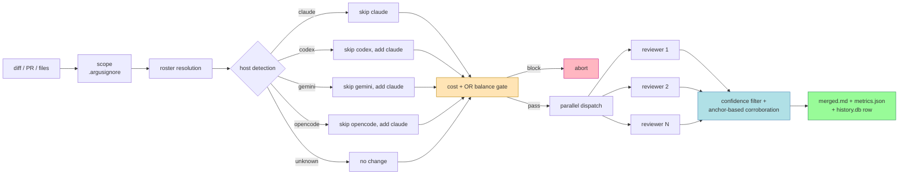
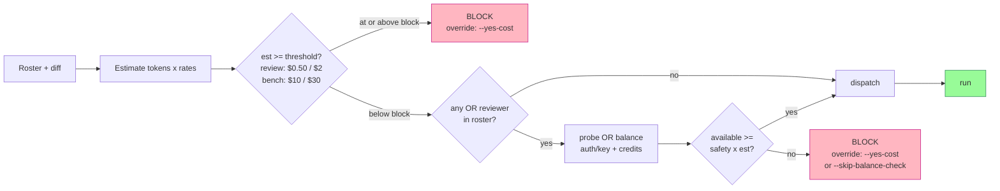

<div align="center">

```
     █████╗ ██████╗  ██████╗ ██╗   ██╗███████╗
    ██╔══██╗██╔══██╗██╔════╝ ██║   ██║██╔════╝
    ███████║██████╔╝██║  ███╗██║   ██║███████╗
    ██╔══██║██╔══██╗██║   ██║██║   ██║╚════██║
    ██║  ██║██║  ██║╚██████╔╝╚██████╔╝███████║
    ╚═╝  ╚═╝╚═╝  ╚═╝ ╚═════╝  ╚═════╝ ╚══════╝

        ●  ●  ●  ●  ●  ●  ●  ●  ●  ●  ●  ●
       ●  ●  ●  ●  ●  ●  ●  ●  ●  ●  ●  ●  ●
        multi-model code review, in parallel
       ●  ●  ●  ●  ●  ●  ●  ●  ●  ●  ●  ●  ●
        ●  ●  ●  ●  ●  ●  ●  ●  ●  ●  ●  ●
```

**Named for Argus Panoptes — the hundred-eyed giant. The original Linus's Law.**

</div>

---

## What

Argus dispatches a diff, PR, or file set to a roster of frontier LLM reviewers — Chinese, Western, and CLI-hosted models — in parallel, applies a confidence filter with cross-reviewer corroboration, and produces one merged review.

It also benchmarks reviewers against labeled fixtures so you can see which models actually find bugs in your domain vs. which ones hallucinate them.

## Why

- **A single LLM reviewer misses bugs.** (They all do, including Opus and GPT-5.)
- **Two LLM reviewers produce noise.** Disagreement without arbitration.
- **Six LLM reviewers filtered by cross-corroboration and confidence** produce meaningfully better reviews than any one model alone.

Argus picks the right six for you, then filters ruthlessly.

---

## Pipeline



---

## Roster

| Reviewer | Route | Notes |
|---|---|---|
| `glm-5.1` | aichat → z.ai Coding Plan (fallback OR `z-ai/glm-4.6`) | strong security + logic |
| `minimax-m2.7` | aichat → minimaxi.chat (fallback OR `minimax/minimax-m2`) | high precision |
| `kimi-k2.6` | aichat → OR `moonshotai/kimi-k2.5` | long-context agentic |
| `mimo-v2-pro` | aichat → OR `xiaomi/mimo-v2-pro` | 1M ctx |
| `qwen-3.6-plus` | aichat → OR `qwen/qwen3.6-plus` | 1M ctx, conservative |
| `grok-4.20` | aichat → OR `x-ai/grok-4.20` | 2M ctx, pricey |
| `deepseek-v3.2` | aichat → OR `deepseek/deepseek-v3.2` | cheap + fast |
| `gemini-or` | aichat → OR `google/gemini-2.5-flash` | 2s/call, best value |
| `gemini` | `gemini` CLI (paid sub) | disabled on Windows (.cmd tree-kill issue) |
| `codex` | `codex` CLI (paid sub) | GPT-5.x, thorough, slow |
| `claude` | `claude` CLI (paid sub) | auto-added when host ≠ claude |
| `opencode` | `opencode` CLI (paid sub) | top performer, slow cold start |
| `hermes-4.3` | aichat → Nous (fallback OR) | custom-only |
| `copilot-gpt5` | GitHub `copilot` CLI | **disabled** — harness returns prose not JSON |

## Profiles

| Profile | Members | Use |
|---|---|---|
| `quick` | `glm-5.1`, `gemini-or` | 2-reviewer smoke test |
| `standard` *(default)* | `glm-5.1`, `minimax-m2.7`, `gemini-or`, `codex` | everyday review |
| `panel` | 10 reviewers | maximum coverage |
| `security` | `glm-5.1`, `deepseek-v3.2`, `codex`, `claude` | auth/crypto/input focus |
| `deep` | `mimo-v2-pro`, `gemini-or`, `kimi-k2.6`, `codex` | long-context, large diffs |
| `favorites` | `glm-5.1`, `minimax-m2.7` | direct-sub picks |
| `leaderboard-top5` | `opencode`, `qwen-3.6-plus`, `glm-5.1`, `gemini-or`, `minimax-m2.7` | benchmark winners |

---

## Reference benchmark

4 fixtures × 3 runs = 12 calls per reviewer. Total spend **~$0.42**.

| Rank | Reviewer | F1 | Precision | Recall | Avg call (s) |
|---|---|---:|---:|---:|---:|
| 🥇 | `opencode` | 0.811 | 0.896 | 0.754 | 48 |
| 🥈 | `qwen-3.6-plus` | 0.761 | **1.000** | 0.650 | 76 |
| 🥉 | `glm-5.1` | 0.697 | 0.772 | 0.725 | 27 |
| 4 | `gemini-or` (Flash) | 0.681 | 0.736 | 0.639 | **2** |
| 5 | `minimax-m2.7` | 0.674 | 0.875 | 0.588 | 29 |
| 6 | `mimo-v2-pro` | 0.652 | 0.736 | 0.600 | 49 |
| 7 | `codex` | 0.581 | 0.688 | 0.754 | 60 |
| 8 | `deepseek-v3.2` | 0.572 | 0.778 | 0.494 | 6 |
| 9 | `grok-4.20` | 0.557 | 0.592 | 0.533 | **2** |
| 10 | `hermes-4.3` | 0.551 | 0.646 | 0.653 | 13 |
| 11 | `kimi-k2.6` | 0.505 | 0.729 | 0.575 | 83 |

Your numbers will differ. Run `--benchmark` on your fixtures.

---

## Installation

### Requirements

```
┌─ core ───────────────────────────────────────────────┐
│  Python 3.12+                                        │
│  aichat 0.30+    (github.com/sigoden/aichat)         │
│  pyyaml, psutil                                      │
├─ at least one CLI reviewer ──────────────────────────┤
│  claude, codex, gemini, opencode, copilot            │
├─ at least one API key ───────────────────────────────┤
│  OPENROUTER_API_KEY (covers 8 of 14 reviewers)       │
│  ZAI_API_KEY, MINIMAX_API_KEY, KIMI_API_KEY          │
│  GEMINI_API_KEY, OPENAI_API_KEY                      │
│  NOUSRESEARCH_API_KEY (optional)                     │
└──────────────────────────────────────────────────────┘
```

### Setup

```bash
git clone https://github.com/<you>/argus.git
cd argus
pip install pyyaml psutil

export ARGUS_HOME="$PWD"

# Configure aichat (api_base only; keys stay in env)
python scripts/install_aichat.py --merge       # merge into existing aichat config
# or --force to overwrite, or --dry-run to preview

# Verify reachability (skips disabled reviewers)
python scripts/verify.py --all

# Seed leaderboard
python scripts/benchmark.py --runs 3 --profile standard --progress
```

### Environment

```bash
export OPENROUTER_API_KEY=...
export ZAI_API_KEY=...            # z.ai Coding Plan endpoint
export MINIMAX_API_KEY=...
export KIMI_API_KEY=...             # consumer-scoped (not Moonshot Platform)
export GEMINI_API_KEY=...
export OPENAI_API_KEY=...
export NOUSRESEARCH_API_KEY=...     # optional, for Hermes direct
```

API keys live in env — **never** written to disk by Argus. aichat reads `AICHAT_<CLIENT>_API_KEY`, which Argus forwards at subprocess dispatch time.

---

## Usage

### Claude Code skill

```
/argus                                     # default profile, diff = git diff HEAD
/argus --profile security
/argus --profile leaderboard-top5
/argus --custom "glm-5.1,deepseek-v3.2,claude"
/argus --pr https://github.com/org/repo/pull/42
/argus --files "src/auth/**/*.ts"
/argus --benchmark --runs 3               # fixture-suite leaderboard
/argus --stats                            # history.db summary
/argus --dry-run                          # cost estimate, no dispatch
```

### Shell

```bash
RUN_DIR="$ARGUS_HOME/runs/$(date +%Y%m%dT%H%M%S)-manual"
mkdir -p "$RUN_DIR"
git diff HEAD > "$RUN_DIR/diff.patch"

python scripts/dispatch.py \
  --run-dir "$RUN_DIR" \
  --roster "glm-5.1,minimax-m2.7,gemini-or,codex" \
  --diff "$RUN_DIR/diff.patch"

python scripts/merge.py --run-dir "$RUN_DIR"
```

## Flags

| Flag | Effect |
|---|---|
| `--profile NAME` | named profile |
| `--custom LIST` / `--models LIST` | one-off roster |
| `--pr URL` / `--files GLOB` / `-` | diff source |
| `--overlay {security,deep,audit}` | prompt overlay |
| `--timeout N` | override 180s per-reviewer timeout |
| `--yes-cost` / `ARGUS_YES_COST=1` | bypass cost + OR balance blocks |
| `--skip-balance-check` | skip OR balance pre-flight |
| `--allow-free` | include free-tier reviewers |
| `--allow-logging` | include reviewers that log prompts |
| `--output {md,json,gsd}` | output format (`gsd` → `REVIEW.md` for `gsd-code-review-fix`) |
| `--save-as NAME` | persist `--custom` roster as profile |

---

## Merge logic

Anchor-based line clustering with dual-tolerance check:


**Why dual tolerance.** A single forward-walking check causes chain drift — findings at lines 10, 13, 16, 19 would all collapse into one cluster (each within ±3 of the previous) even though lines 10 and 19 are 9 apart. Anchor-check alone handles this, but can reject near-duplicates that happen to land just over the anchor tolerance. Both checks together: tight when cluster stays compact, rejects drift when it doesn't.

---

## Cost control

Two independent gates, both enforceable:



| Mode | Warn | Hard block | Override |
|---|---|---|---|
| review | $0.50 | $2.00 | `--yes-cost` / `ARGUS_YES_COST=1` |
| benchmark | $10 | $30 | `--yes-cost` / `ARGUS_YES_COST=1` |
| OR balance | (auto) | `available < safety × estimate` | `--skip-balance-check` |

Paid-CLI reviewers (Gemini, Codex, Claude, OpenCode, Copilot) incur no tracked cost — they use host subscriptions.

---

## Host-CLI awareness

| Host | Skip | Add |
|---|---|---|
| claude | `claude` | — |
| codex | `codex` | `claude` |
| gemini | `gemini` | `claude` |
| opencode | `opencode` | `claude` |
| unknown | — | — |

Rule: never ask the host CLI to review its own invocation. Always ensure Claude is in the mix when Claude isn't the host. Detection via env vars + parent-process walk (psutil, up to 8 levels).

---

## Benchmark mode

```bash
python scripts/benchmark.py --runs 3 --profile panel --progress
```

For large rosters, prefer one shell per reviewer with a shared timestamp:

```bash
TS=$(date +%Y%m%dT%H%M%S)
for reviewer in glm-5.1 minimax-m2.7 gemini-or codex opencode; do
  python scripts/benchmark.py \
    --roster "$reviewer" \
    --runs 3 \
    --progress \
    --benchmark-ts "$TS" \
    --max-wall-sec 600 &
done
wait
python scripts/aggregate_bench.py --ts "$TS"
```

Produces:
- `benchmarks/<ts>/per_reviewer/<name>.json` — incremental, tailable during the run
- `benchmarks/<ts>.md` — leaderboard + per-fixture detail + agreement matrix + redundancy suggestions
- `benchmarks/<ts>.json` — full machine-readable data
- rows in `history.db:benchmarks` — longitudinal comparison

The aggregator re-scores from `tp/fp/fn` per run, correctly handles clean-baseline (P=R=F1=1.0 when reviewer correctly finds nothing), and produces the unified leaderboard.

---

## Fixtures

Each fixture is a directory under `fixtures/`:

```
fixtures/my-bug-type/
├── diff.patch             # git-diff output
└── ground-truth.json      # known bugs
```

Ground truth format:

```json
{
  "fixture_id": "my-bug-type",
  "description": "What this fixture tests",
  "line_tolerance": 3,
  "issues": [
    {
      "file": "src/foo.py",
      "line": 42,
      "severity": "high",
      "category": "security",
      "summary": "SQL injection via string interpolation"
    }
  ]
}
```

Scoring: a finding matches a ground-truth issue if `file` matches and `abs(finding.line - truth.line) ≤ line_tolerance`.

| | Findings match ground truth | Finding is phantom | Truth was missed |
|---|---|---|---|
| Counted as | `tp` | `fp` | `fn` |

From which: `precision = tp / (tp + fp)`, `recall = tp / (tp + fn)`, `F1 = 2PR / (P+R)`. Clean baselines (`issues: []`) with no findings reported score `P=R=F1=1.0`.

Seeded fixtures:

- **`sql-injection`** — parameterized queries → string interpolation
- **`race-refund`** — transaction boundaries removed
- **`secrets-leak`** — hardcoded key + error-swallowing
- **`clean-baseline`** — innocuous refactor (FP-rate control)

---

## Quality mechanics (summary)

1. **Strict-schema JSON** — reviewers return `{findings: [{file, line, severity, category, description, confidence}]}`. Extractor tolerates fenced blocks, `<think>` prefixes, stray prose.
2. **Context-window pre-check** — skip reviewer if prompt > 70% of their ctx (reviewer's `skip_reason` logged; other reviewers continue).
3. **Confidence threshold** — drop findings with effective confidence < 80.
4. **Anchor-based clustering + corroboration boost** — +15 confidence (cap 100) when ≥ 2 reviewers agree within ±3 lines on the same file.
5. **Severity + confidence sort** — critical → low, ties broken by confidence desc.
6. **OpenRouter reasoning-exclude** — `patch.chat_completions` applies `reasoning: {exclude: true, max_tokens: 2000}` + `provider: {ignore: [io.net, together.ai]}` to avoid providers that return `content: null` with reasoning-only.
7. **Per-reviewer incremental writes** — in benchmark mode, reviewer JSONs land as each reviewer completes. Tailable during runs.
8. **Fallback routing** — every reviewer has an optional fallback (typically OR); sum of primary + fallback latency is reported so you see real wall time.

---

## Layout

```
argus/
├── SKILL.md                    # Claude Code skill entry
├── README.md                   # this file
├── CLAUDE.md                   # project context for contributors
├── CONTRIBUTING.md
├── LICENSE                     # MIT
├── config.yaml                 # reviewers, profiles, host rules, CLI commands, aichat patches
├── prompts/
│   ├── reviewer_prompt.md
│   └── overlays/
│       ├── security.md
│       ├── deep.md
│       └── audit.md
├── scripts/
│   ├── _common.py              # shared helpers
│   ├── detect_host.py          # host CLI detection
│   ├── dispatch.py             # parallel reviewer fan-out
│   ├── merge.py                # confidence filter + corroboration + output
│   ├── benchmark.py            # fixture-suite runner
│   ├── aggregate_bench.py      # merge per-reviewer JSONs from parallel-shell runs
│   ├── estimate_cost.py        # pre-flight cost gate
│   ├── bench_cost.py           # retrospective cost analysis
│   ├── verify.py               # route reachability ping
│   ├── or_balance.py           # OpenRouter balance check
│   ├── stats.py                # history.db summary
│   ├── install_aichat.py       # aichat config management
│   └── adapters/
│       ├── aichat.py
│       ├── gemini_cli.py
│       ├── codex_cli.py
│       ├── claude_cli.py
│       ├── opencode_cli.py
│       └── copilot_cli.py
├── fixtures/                   # benchmark inputs
│   ├── sql-injection/
│   ├── race-refund/
│   ├── secrets-leak/
│   └── clean-baseline/
├── runs/                       # per-invocation artifacts (gitignored)
├── benchmarks/                 # leaderboard outputs (gitignored)
└── history.db                  # SQLite — runs, findings, benchmarks (gitignored)
```

---

## Known gotchas

```
┌──────────────────────────────────────────────────────────────────────────┐
│  Windows .cmd shim tree-kill problem                                     │
│  ─────────────────────────────────────                                   │
│  Node CLIs (gemini, copilot) don't tree-kill children on subprocess      │
│  timeout. Causes zombie node.exe processes.                              │
│                                                                          │
│  Mitigation: gemini-direct disabled by default; use gemini-or instead    │
│  (same family via OpenRouter).                                           │
├──────────────────────────────────────────────────────────────────────────┤
│  OpenRouter reasoning-provider trap                                      │
│  ──────────────────────────────────                                      │
│  z-ai/glm-5.1 and minimax/minimax-m2.7 slugs can route to Io Net or      │
│  Together providers that return {content: null, reasoning: "..."}.       │
│                                                                          │
│  Mitigation: aichat patch applies reasoning-exclude + provider-ignore.   │
│  config.yaml: aichat_clients.openrouter.patch.chat_completions           │
├──────────────────────────────────────────────────────────────────────────┤
│  Argv length on Windows (~32KB)                                          │
│  ──────────────────────────────                                          │
│  gemini-cli and copilot-cli embed the prompt as a command-line arg.      │
│  Diffs > 30KB fail.                                                      │
│                                                                          │
│  Mitigation: use --files to scope, or rely on aichat adapters (stdin).   │
├──────────────────────────────────────────────────────────────────────────┤
│  Full-codebase audit prompt mismatch                                     │
│  ───────────────────────────────────                                     │
│  The default reviewer prompt is optimized for PR review. On empty-tree   │
│  → HEAD diffs, some reviewers return [] because "it's all new code".     │
│                                                                          │
│  Mitigation: --overlay audit (counteracts the "greenfield" bias).        │
└──────────────────────────────────────────────────────────────────────────┘
```

---

## Contributing

See `CONTRIBUTING.md`. TL;DR: reviewer/provider changes are config-only. Fixture contributions sharpen the benchmark and are the highest-leverage way to help.

## License

MIT — see `LICENSE`.

---

<div align="center">

*"For though he had many eyes, Hermes by his cleverness caused them all to sleep."*
— Apollodorus, *Library*, 2.1.3

When a bug slips past Argus, ask whether you put him to sleep with a bad prompt.

</div>
